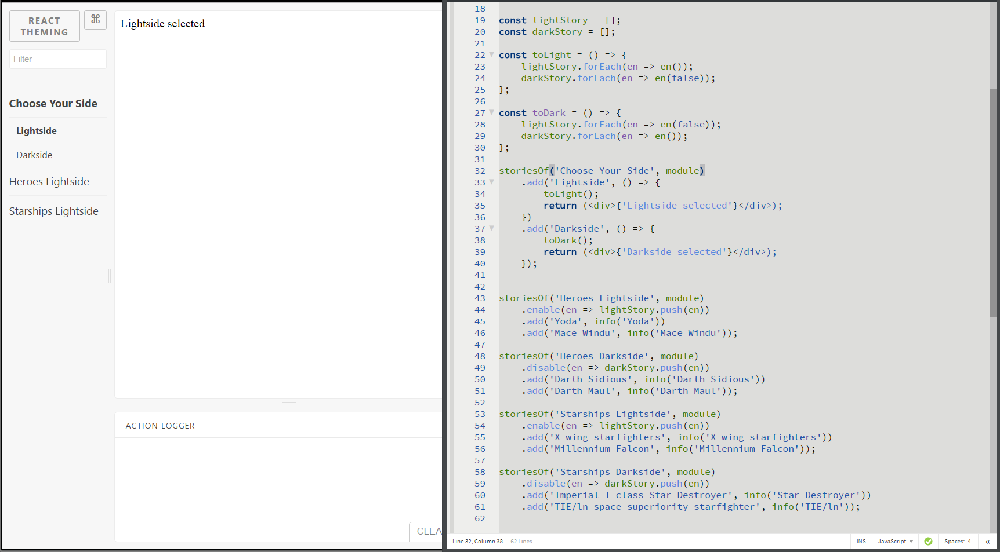

# storybook-chapters 
[](https://badge.fury.io/js/storybook-chapters)
[](https://sm-react.github.io/storybook-chapters)

This **addon** for React Storybook adds unlimited levels of **nesting for stories**. 

## Enable/Disable example

```shell
git clone https://github.com/sm-react/storybook-chapters.git
cd storybook-chapters/example/enable
yarn
yarn start
```

open http://localhost:9001 in your browser

open [`/src/stories/index.js`](https://github.com/sm-react/storybook-chapters/blob/master/example/enable/src/stories/index.js) in your code editor

start hacking ;)

[](https://raw.githubusercontent.com/sm-react/storybook-chapters/master/example/enable/doc/chapters-enable.png)
