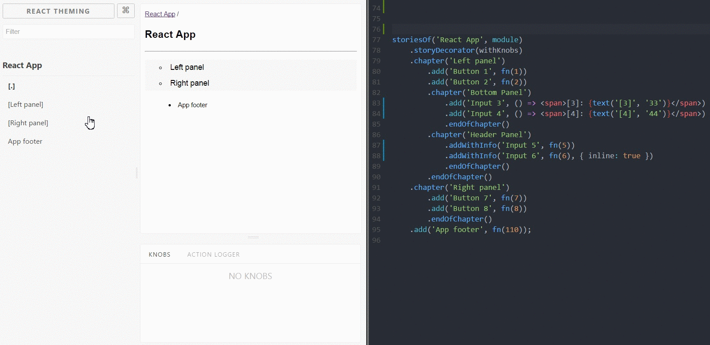

# 📖 @storybook/addon-chapters 
[](https://badge.fury.io/js/%40storybook%2Faddon-chapters)
[](https://sm-react.github.io/storybook-chapters)

This **addon** for React Storybook adds unlimited levels of **nesting for stories**. 


[](https://raw.githubusercontent.com/sm-react/storybook-chapters/master/doc/img/preview.gif)


## Usage

```shell
yarn add @storybook/addon-chapters --dev
```

```js
// .storybook/config.js:

import '@storybook/addon-chapters';

```

```js
//addons.js:

import '@storybook/addon-chapters/register';

```

```js
// stories.js:

storiesOf('React App', module)
    .addChapter('Atoms', chapter => chapter
        .add('Atom 1', render(1))
        .add('Atom 2', render(2))
        .addChapter('Molecules', chapter => chapter
            .addChapter('Organisms', chapter => chapter
                .add('Organism 1', render(7))
                .add('Organism 2', render(8)),
            )
            .add('Molecule 1', render(1))
            .add('Molecule 2', render(2)),
        )
        .add('Atom 3', render(3))
        .add('Atom 4', render(4)),
    )
    .add('new API docs', render(3))
    .add('prev API docs', render(4));

```

## Features

- The hierarchical structure of Substories
- Hide/show your stories with `enable`/`disable` and buid your own navigation
- Compatible with `Knobs`, `addWithInfo` and other addons
- Use `storyDecorator` to wrap all chapters
- Support query params of the address string to select (sub)chapter (same behavior as storybook holds current storyKind when you reload the page)
- jumping between chapters
- Storybook 3.0 compatible

## Examples

### Basic

[story](https://github.com/sm-react/storybook-chapters/blob/master/example/basic/src/stories/index.js)

Lets add 'chapters' to [Storybook Boilerplate](https://github.com/sm-react/react-theming#storybook-boilerplate-project):

```shell
git clone https://github.com/sm-react/storybook-chapters.git
cd storybook-chapters/example/basic
yarn
yarn start

```

### Choose your side with Enable / Disable API

[story](https://github.com/sm-react/storybook-chapters/blob/master/example/enable/src/stories/index.js)

```shell
git clone https://github.com/sm-react/storybook-chapters.git
cd storybook-chapters/example/enable
yarn
yarn start
```
===

## API

There are two possible API to add chapters. You can use one of them or make any combination of them. You can access chapters features as `storiesOf('Kind Name', module).chapter('Chapter Name')` or `storiesOf('Kind Name', module).addChapter('Chapter Name', chapter => add(chapter))`

Here's the list of available API:

### .chapter / .addChapter / .endOfChapter

Use this API to organize your story hierarchy

##### 📎 .addChapter(ChapterName, chapterProcessingFn)

 `.addChapter('ChapterName', chapter => chapter)` adds `ChapterName` subchapter to the root of `storiesOf` or to the current chapter and invokes function passed as second argument. This function provide same API as `storiesOf` (including third-party addons) with the difference that everything you add here will be applyed to this current chapter. E.g.  `chapter => chapter.add()` to add stories to this chapter and `chapter => chapter.addChapter()` to add subchapters.

*example:*
```js
storiesOf('addChapter API', module)
    .addChapter('Atoms', chapter => chapter
        .add('Atom 1', render(1))
        .add('Atom 2', render(2))
        .addChapter('Molecules', chapter => chapter
            .addWithInfo('Molecule 1', render(1))
            .addWithInfo('Molecule 2', render(2)),
        )
    );

```

Note how we use `.addWithInfo` to add stories to `.chapter('Molecules')`


##### 📎 .chapter(ChapterName)

`.chapter(ChapterName)` adds `ChapterName` subchapter to the root of `storiesOf` or to the current chapter. You can use any other API (going with `storybook-chapter` or any other third-party addon) after this and it will apply to this current chapter. E.g.  `.add()` to add stories to this chapter and `.chapter()` to add subchapters. Use `.endOfChapter()` to shift back to the parent or root chapter.

*example:*
```js
storiesOf('.chapter API', module)
    .chapter('Bottom Panel')
        .add('Input 3', () => <span>[3]: {text('[3]', '33')}</span>)
        .add('Input 4', () => <span>[4]: {text('[4]', '44')}</span>)
        .endOfChapter()
    .chapter('Header Panel')
        .addWithInfo('Input 5', render(5))
        .addWithInfo('Input 6', render(6), { inline: true })
        .endOfChapter()

```
Note how we use `.addWithInfo` to add stories to `.chapter('Header Panel')`

##### 📎 .endOfChapter()

`.endOfChapter()` jumps to the parent chapter created by `.chapter` API. Don't need to use it with `.addChapter` API.

##### chapters UI ❗️❗️❗️

When you add chapter to your `storiesOf` or to another chaper it will be shown in the left panel in square brackets e.g. `[subchapter]`, so you can always distinguish subchapters from normal stories. If you click to this `[subchapter]` it'll redirect you to this chapter automatically and show the TOC of this chapter (the first story of any chapter). Below this TOC you'll find the item for jumping back to the parent level. 
[demo](https://sm-react.github.io/storybook-chapters/?selectedKind=Left%20panel&selectedStory=%E2%84%B9%EF%B8%8F&full=0&down=1&left=1&panelRight=0&downPanel=storybooks%2Fstorybook-addon-knobs)

Such UI is a workaround until Storybook provides better API for customizing left panel.

### .add

📎 `.add(name, story)` add stories to the current chapter

### { jumpTo } / .bookmark

Linking to other stories ( `linkTo` analog for chapters )

##### 📎 jumpTo(chapter, story)

Jumps to the `story` of `chapter`. Use is instead of `linkTo` from `@storybook/addon-links`. You need to require it from `@storybook/addon-chapters`.

*example:*
```js
import { storiesOf } from '@storybook/react';
import { jumpTo } from '@storybook/addon-chapters';

storiesOf('.chapter API', module)
    .chapter('Bottom Panel')
        .add('Input 3', () => <button onClick={jumpTo('Bottom Panel', 'Input 4')}>)
        .add('Input 4', () => <button onClick={jumpTo('Header Panel', 'Input 5')}>)
        .endOfChapter()
    .chapter('Header Panel')
        .addWithInfo('Input 5', render(5))
        .addWithInfo('Input 6', render(6), { inline: true })
        .endOfChapter()

```

[demo](https://sm-react.github.io/storybook-chapters/?selectedKind=Atoms%20with%20bookmarks&selectedStory=Jump%20To%20Organism%201&full=0&down=1&left=1&panelRight=0&downPanel=storybooks%2Fstorybook-addon-knobs)

Note that we don't need to register `jumpTo` in `addons.js`

##### 📎 .bookmark(jumpToFn => {})

Another way to organize linking between stories. Simply add bookmark to the story/chapter and use it to jump when you need. It provide `jumpToFn()` function for that. It's possible to add bookmarks to both stories and chapters.

*example:*
```js
import { storiesOf } from '@storybook/react';

const bookmarks = {};

storiesOf('Bookmarks API', module)
    .addChapter('Atoms', chapter => chapter
        .bookmark((bm) => { bookmarks.Atoms = bm; })
        .add('Atom 1', fn(1))
        .bookmark((bm) => { bookmarks.Atom1 = bm; })
        .add('Atom 2', fn(2))
        .add('LinkTo 1', () => (<button onClick={bookmarks.Atom1}> Go to Atom 1 </button>))
        .add('LinkTo 2', () => (<button onClick={bookmarks.Atoms}> Go to Atoms </button>))
    )
```

[demo](https://sm-react.github.io/storybook-chapters/?selectedKind=Atoms%20with%20bookmarks&selectedStory=Bookmark%20To%20Atom1&full=0&down=1&left=1&panelRight=0&downPanel=storybooks%2Fstorybook-addon-knobs)

##### 📎 .bookmarkList()

Displays all bookmarks of the current chapter and subchapters.

*example:*
```js
import { storiesOf } from '@storybook/react';

const bookmarks = {};

storiesOf('Bookmarks API', module)
    .addChapter('Atoms', chapter => chapter
        .bookmark()
        .add('Atom 1', fn(1))
        .bookmark()
        .add('Atom 2', fn(2))
        .bookmarkList()
    )
```

[demo](https://sm-react.github.io/storybook-chapters/?selectedKind=Atoms%20with%20bookmarks&selectedStory=%F0%9F%94%96&full=0&down=1&left=1&panelRight=0&downPanel=storybooks%2Fstorybook-addon-knobs)

### .storyDecorator

📎 `.storyDecorator(decorator)` adds decorators to whole `storiesOf` (including subchapters). Enables "chapters". You can put it in any place of chapters tree, result will be the same.

### .disable / .enable

📎 `.disable(enableFn => {})` - temporarily hides current `storiesOf`. `enableFn()` - function to hide/show these stories:

```js
enableFn(true)  // to show this stories
enableFn(false) // to hide this stories
```

[demo](https://sm-react.github.io/storybook-chapters/?selectedKind=.addChapter%20API&selectedStory=choose%20Dark%20side&full=0&down=1&left=1&panelRight=0&downPanel=storybooks%2Fstorybook-addon-knobs)

It enables "chapters"

📎 `.enable(enableFn => {})` - don't hide current `storiesOf` but provides function `enableFn()` to control visibility of these stories. Enables "chapters"

You can use `enable`/`disable` to build custom navigation with your preferred logic. 
For example, you can use `enableFn()` in another stories, decorators or [addon panels](#roadmap) 

### mixing `.addChapter` and `.chapter`. 
It's possible to use any combination of this API.

*example:*
```js
storiesOf('Mixed API', module)
    .addChapter('Atoms new', chapter => chapter
        .add('Atom 1', fn(1))
        .add('Atom 2', fn(2))
        .addChapter('Molecules new', chapter => chapter
            .chapter('Cells old')
                .add('Cell 1', fn(1))
                .add('Cell 2', fn(2))
                .addChapter('Organisms new in old', chapter => chapter
                    .add('Organism 1', fn(1))
                    .add('Organism 2', fn(2)),
                )
                .endOfChapter()
            .add('Molecule 1', fn(1))
            .add('Molecule 2', fn(2)),
        )
        .add('Atom 3', fn(3))
        .add('Atom 4', fn(4)),
    )
    .add('new API docs', fn(3))
    .add('prev API docs', fn(4));
```

[demo](https://sm-react.github.io/storybook-chapters/?selectedKind=Mixed%20API&selectedStory=%E2%84%B9%EF%B8%8F&full=0&down=1&left=1&panelRight=0&downPanel=storybooks%2Fstorybook-addon-knobs)

[example](https://github.com/sm-react/storybook-chapters/blob/master/stories/index.js#L154-L175)

### enabling chapters

To enable chapters you need to apply one of privided API first:

```js
// right:
storiesOf('React App1', module)
  .addChapter('Left panel', chapter => 
    chapter.add('item1', render())
  );

storiesOf('React App2', module)
  .chapter('Left panel')
    .add('item1', render());

storiesOf('React App3', module)
  .enable()
  .add('item1', render());

// wrong:
storiesOf('React App', module)
  .add('item1', render())
  .chapter('Left panel');

```
## Query string

Storybook-Chapters use the same query params to set current storiKind/story as Storybook. It means that you can reload page and don't lose current chapter. Or you can share the link of your chapter/story to point to exact place of your story.

[demo](https://sm-react.github.io/storybook-chapters/?selectedKind=Organisms&selectedStory=Organism%201&full=0&down=1&left=1&panelRight=0&downPanel=storybooks%2Fstorybook-addon-knobs)

## Roadmap

- Page spreads API (all stories and subchapters on the one page. Could be useful for creating styleguides). Same as `chapter` will be two API: `.spread()` and `.addSpread()`:

*example:*
```js
storiesOf('Mixed API', module)
    .addChapter('Atoms new', chapter => chapter
        .add('Atom 1', fn(1))
        .add('Atom 2', fn(2))
        .addSpread('Molecules new', chapter => chapter
            .chapter('Cells old')
                .add('Cell 1', fn(1))
                .add('Cell 2', fn(2))
                .addChapter('Organisms new in old', chapter => chapter
                    .add('Organism 1', fn(1))
                    .add('Organism 2', fn(2)),
                )
                .endOfChapter()
            .add('Molecule 1', fn(1))
            .add('Molecule 2', fn(2)),
        )
        .add('Atom 3', fn(3))
        .add('Atom 4', fn(4)),
    )
    .add('new API docs', fn(3))
    .add('prev API docs', fn(4));
```

It could be putted in any place of hierarchy. All chapters and stories added to spread will be shown in one page. Chapters and subchapters will be transformed to sections and subsections in that case.

- Summary API (autogenerated page spread for the current chapter)

- Chapter decorators (decorate only the current chapter with subchapters)

- Custom TOC UI (apply custom page to the chapter [.] story instead of the default one)

- Custom bookmarkList UI (apply custom page to the bookmarkList instead of the default one)

- wrap (decorate stories with addons like `.addWithSmth`)

- API to set custom bages for ℹ️, ⤴️ and 🔖

- Better chapters navigation UI on the left panel. We need storybook API improvement for that. Then we can stop using workaround solution with ℹ️, ⤴️ signs and offer something more convenient and customizible. 

## Warning

**@storybook/addon-chapters** has a big progress and works stable with the current Storybook version (v3). But Storybook is developing rapidly and API could be changed. We do our best to support this addon viable and compatible with the latest versions of Storybook. Reporting an issue as soon as it is detected - an excellent opportunity to help us in the development of this addon and quickly restore its performance

## Development

- `git clone` this repo

- `yarn` to install dependencies

- `yarn start` storybook and open `http://localhost:9001/`

- see comments in src files:

-- `src/chapters/addon.js` for addons API functions

-- `src/chapters/navigate.js` for navigation functions

-- `src/chapters/store.js` for data storage organization

- see `stories/index.js` for development

## Related projects

[storybook-filepath-chapters](https://github.com/hadfieldn/storybook-filepath-chapters) by @hadfieldn -  React Storybook loader that uses storybook-chapters to create hierarchical navigation that mirrors the filesystem

## Credits

Big thanks to [Norbert de Langen](https://github.com/ndelangen) for the idea of `.addChapter` API

We'd be happy to receive feedback from this project. Any issue or PR will be very appreciated!

<div align="left" style="height: 16px;"><sub>Created with ❤︎ to <b>React</b> and <b>React Storybook</b> by <a href="https://twitter.com/UsulPro">@UsulPro</a> and     <a href="https://github.com/sm-react/react-theming">React Theming</a>.</sub></div>

